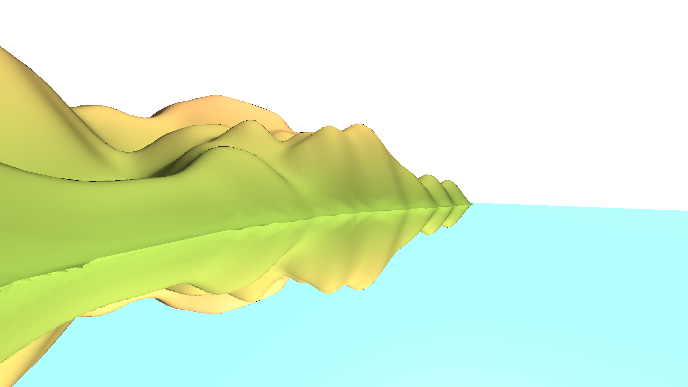
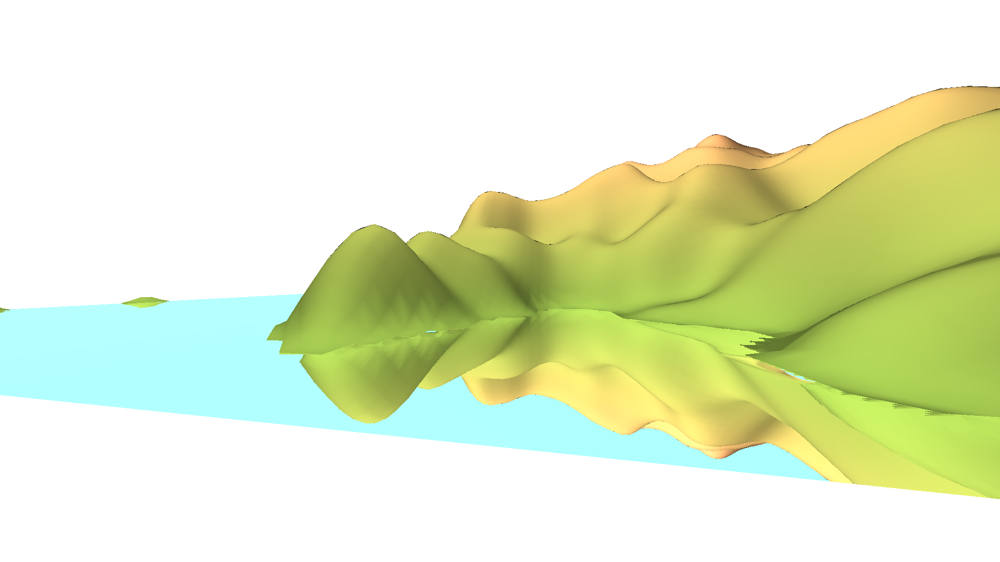

# Project report - Group 5

###### Markus Ding, Robin Mamie & Charline Montial

## Achievements

The screen space reflection feature has been implemented.
The dynamic waving water, using Perlin noise as requested, is also done.

## Preliminary results

{width="600px"}

{width="600px"}

{width="600px"}

{width="600px"}

{width="600px"}

## Updated schedule

The next extension we plan on implementing probably are the shadows - the 4th extension proposed.

To deal with the ugly water borders as seen on the screens, we will split the one mesh we currently have into two.
One will be the normal terrain, the other will exclusively be the water.
This will give a far more natural look to our coasts by eliminating this "vertical mirror" look.
It will eventually enable us to add some transparency to the water.

Diverse optimizations will be made on what was already written (screen space reflections for the most part).
