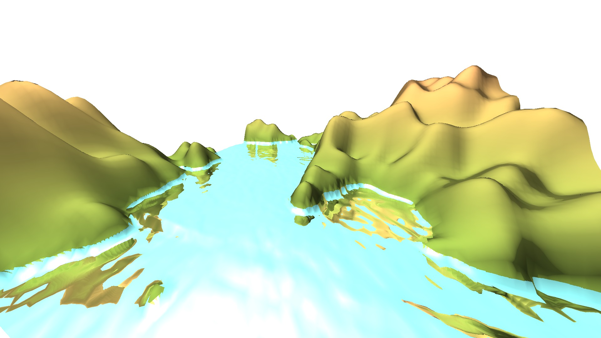

# Milestone report - Thursday 16th

## Summary of what we have accomplished so far

The screen space reflection feature has been implemented as well as the waving water, using Perlin noise as requested.
Also, we gave a more realistic color to the water and Phong has been added to it.

## Primary results

Unfortunately screenshots can obviously not show the waving water which is now dynamic. However, they show that not only the water has Phong, but it also reflects what surrounds it. On top of that, we can see the Perlin noise adding a realistic effect to it.

{width="600px"}

{width="600px"}

## Updated schedule

### Week 12
#### Refraction and sky with clouds

- Markus: Refraction
- Robin: Sky
- Charline: Clouds

### Week 13
#### Procedural terrain of the GPU and directional shadow

- Markus: GPU
- Robin: Shadows
- Charline: Shadows
